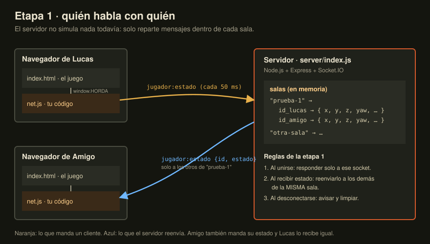

# Etapa 1 · Salas y ver a los demás jugadores

**Objetivo:** dos pestañas con el mismo código de sala se ven moverse entre sí, con su personaje, su arma y su nombre encima. En el radar el otro aparece como un punto azul.

Todavía **no** se sincronizan zombies ni disparos: cada uno ve sus propios zombies. Eso llega en las etapas 2 y 3.



## Qué vas a escribir

| Archivo | Qué hace |
|---|---|
| `server/index.js` | TODO 1, 2, 3: guardar salas, reenviar estados, limpiar al salir |
| `public/net.js` | TODO A–F: conectarse, mandar tu estado, dibujar a los demás |

No tienes que tocar `public/index.html`. Todo lo que necesitas del juego está en `window.HORDA` (lista en la cabecera de `net.js`).

## El protocolo (los mensajes)

Usa exactamente estos nombres para que las pistas coincidan.

| Evento | Dirección | Datos |
|---|---|---|
| `sala:unirse` | cliente → servidor | `{ room, name, skin, map }` |
| `sala:bienvenida` | servidor → **solo** quien entró | `{ id, jugadores: { [id]: estado } }` |
| `jugador:estado` | cliente → servidor | `estado` (lo que da `HORDA.getLocalState()`) |
| `jugador:estado` | servidor → **los demás** de la sala | `{ id, estado }` |
| `jugador:salio` | servidor → los demás de la sala | `{ id }` |

### Traza: Lucas entra, luego Amigo

```
t=0.00  Lucas   → srv   sala:unirse     { room:"prueba-1", name:"Lucas", skin:0, map:"ciudadela" }
t=0.01  srv     → Lucas sala:bienvenida { id:"aaa", jugadores:{ aaa:{name:"Lucas",…} } }   ← solo él
t=0.05  Lucas   → srv   jugador:estado  { x:32.5, y:1, z:8.5, yaw:3.14, … }
        srv     → (nadie más en la sala todavía)
t=3.00  Amigo   → srv   sala:unirse     { room:"prueba-1", name:"Amigo", skin:1, … }
t=3.01  srv     → Amigo sala:bienvenida { id:"bbb", jugadores:{ aaa:{…último estado de Lucas…}, bbb:{…} } }
t=3.05  Lucas   → srv   jugador:estado  { x:32.5, y:1, z:9.1, … }
t=3.05  srv     → Amigo jugador:estado  { id:"aaa", estado:{ x:32.5, … } }                  ← no a Lucas
t=3.06  Amigo   → srv   jugador:estado  { x:32.5, y:1, z:8.5, … }
t=3.06  srv     → Lucas jugador:estado  { id:"bbb", estado:{…} }
t=9.00  Amigo cierra la pestaña
t=9.00  srv     → Lucas jugador:salio   { id:"bbb" }
```

Fíjate en la línea `t=3.01`: Amigo necesita el **último estado** de Lucas para dibujarlo aunque Lucas esté quieto y no mande nada nuevo. Por eso el servidor tiene que guardarlo, no solo reenviarlo.

## Pistas (ábrelas de a una)

<details><summary>Pista 1 · la estructura de <code>salas</code></summary>

Un `Map` de `Map`s: `codigoSala → (socket.id → último estado)`. Así, “todos los de la sala X” es `salas.get(x)` y quitar a uno es `.delete(socket.id)`.
</details>

<details><summary>Pista 2 · “a él” vs “a los demás” en Socket.IO</summary>

- `socket.emit(...)`: solo a ese cliente.
- `socket.to(sala).emit(...)`: a todos los de la sala **menos** ese socket.
- `io.to(sala).emit(...)`: a todos los de la sala, incluido él.

Y para entrar a la sala: `socket.join(sala)`.
</details>

<details><summary>Pista 3 · ¿en qué sala estaba este socket al desconectarse?</summary>

Dentro de `io.on('connection', socket => { ... })` puedes declarar `let sala = null;` y asignarla en `sala:unirse`. Cada conexión tiene su propia variable gracias al closure. Así el `disconnect` sabe de dónde sacarlo.
</details>

<details><summary>Pista 4 · mandar tu estado sin saturar la red</summary>

`setInterval(() => ..., 50)` da 20 envíos por segundo, que alcanza para que se vea fluido porque el juego ya interpola a los demás. Usa `socket.volatile.emit(...)`: si un paquete se atrasa, se descarta en vez de encolarse, y para posiciones solo importa la más reciente.

Guarda el id del intervalo para poder hacer `clearInterval` en `onMenu`.
</details>

<details><summary>Pista 5 · la bienvenida trae también tu propio id</summary>

En `sala:bienvenida` recorre `Object.entries(jugadores)` y salta tu propio `id`. También salta a quien todavía no mandó posición (no tiene `x`).
</details>

<details><summary>Pista 6 · no confíes en el cliente</summary>

Antes de `socket.join`, valida que `room` sea un texto corto con caracteres seguros, por ejemplo con `/^[a-z0-9_-]{1,24}$/`. Cualquiera puede abrir la consola del navegador y mandarte lo que quiera.
</details>

## Cómo probar

1. `npm run dev`
2. Abre `http://localhost:3000` en **dos** pestañas (o una normal y una de incógnito).
3. En ambas: mismo mapa, mismo código de sala (por ejemplo `prueba-1`), nombres distintos → Jugar.
4. Muévete en una y mira la otra. Con **V** pasas a tercera persona para verte al lado del otro.

En la consola del servidor deberías ver `[+] conectado …` por cada pestaña.

**Para probar con alguien en tu misma red:** averigua tu IP local con `ipconfig` (algo como `192.168.1.34`) y que tu amigo abra `http://192.168.1.34:3000`. Si no carga, es el firewall de Windows: permite Node.js en redes privadas.

## Si algo falla

| Síntoma | Causa probable |
|---|---|
| Te ves a ti mismo duplicado | Reenviaste con `io.to(sala)` en vez de `socket.to(sala)`, o no saltaste tu id en la bienvenida |
| El segundo no ve al primero hasta que este se mueve | El servidor no guarda el último estado, o la bienvenida no lo incluye |
| Al cerrar una pestaña el muñeco se queda congelado | Falta `jugador:salio` en `disconnect` |
| Se ven jugadores de otra sala | Reenviaste a todos (`socket.broadcast.emit`) en vez de a la sala |
| `io is not defined` en la consola | Abriste `index.html` como archivo; tiene que ser por `http://localhost:3000` |

## Pregunta para pensar antes de la etapa 2

Si en PvP el cliente dice “le di a Amigo en la cabeza”, ¿por qué el servidor no debería creerle? ¿Qué necesita saber el servidor para decidirlo él mismo?

## Cuando funcione

```bash
git add .
git commit -m "Etapa 1: salas y sincronizar jugadores"
git push
```

Y avísame para pasar a la etapa 2.
